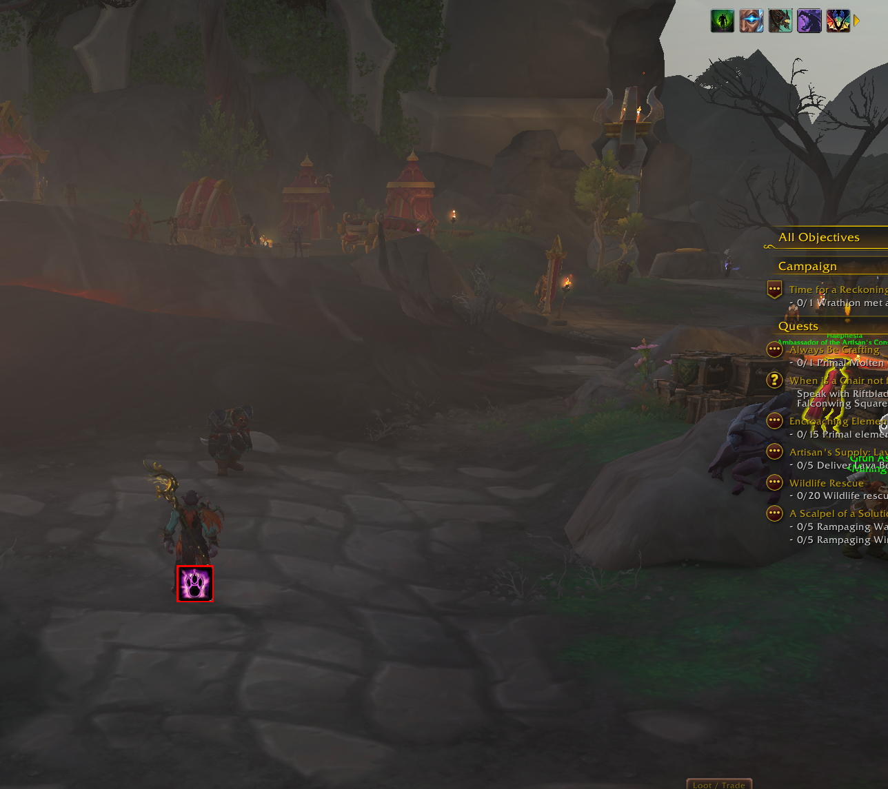
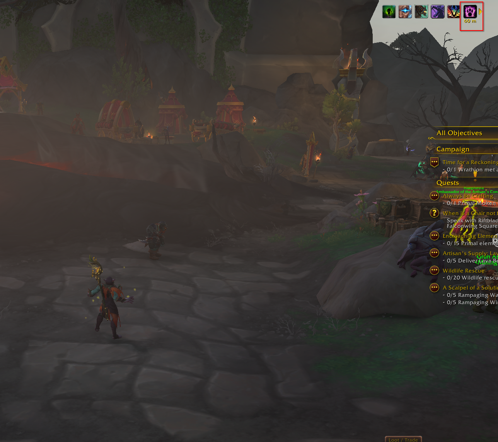
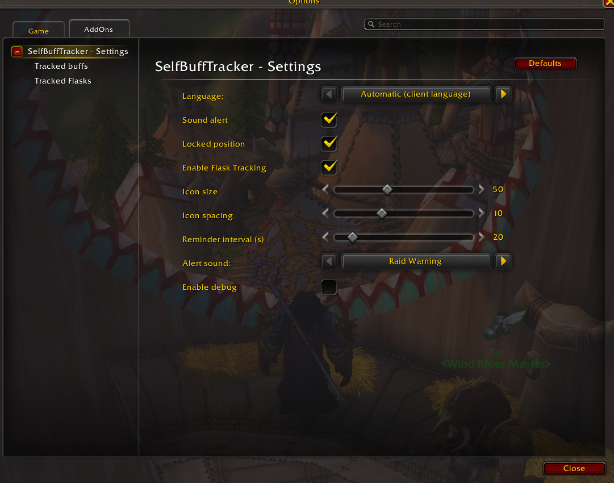
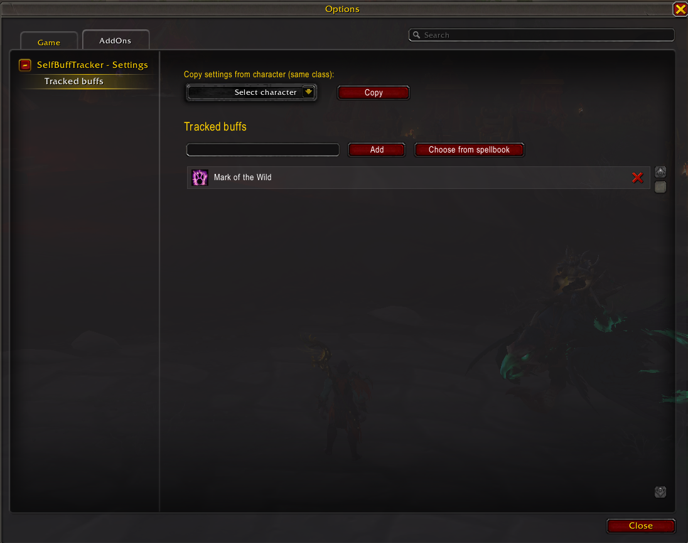
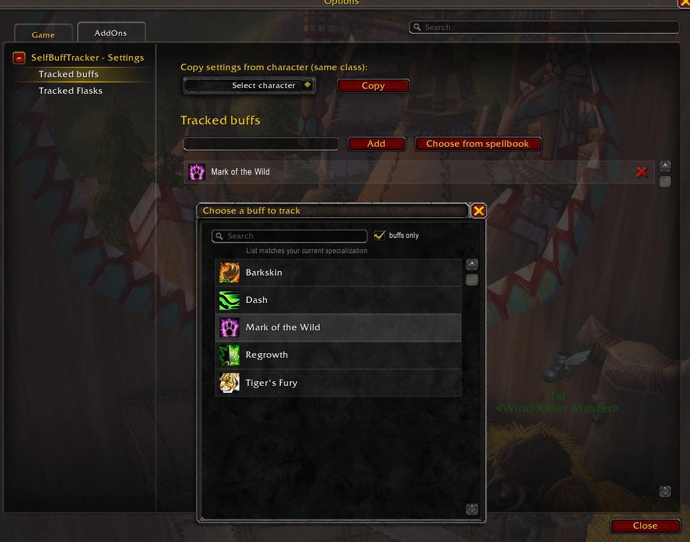
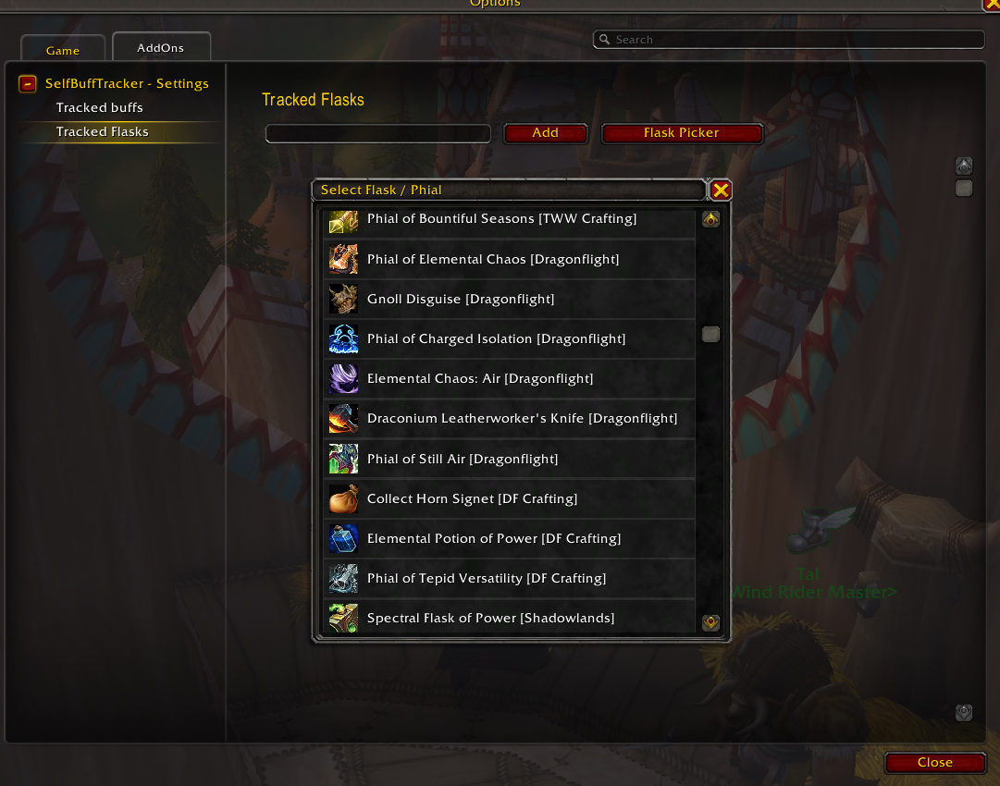
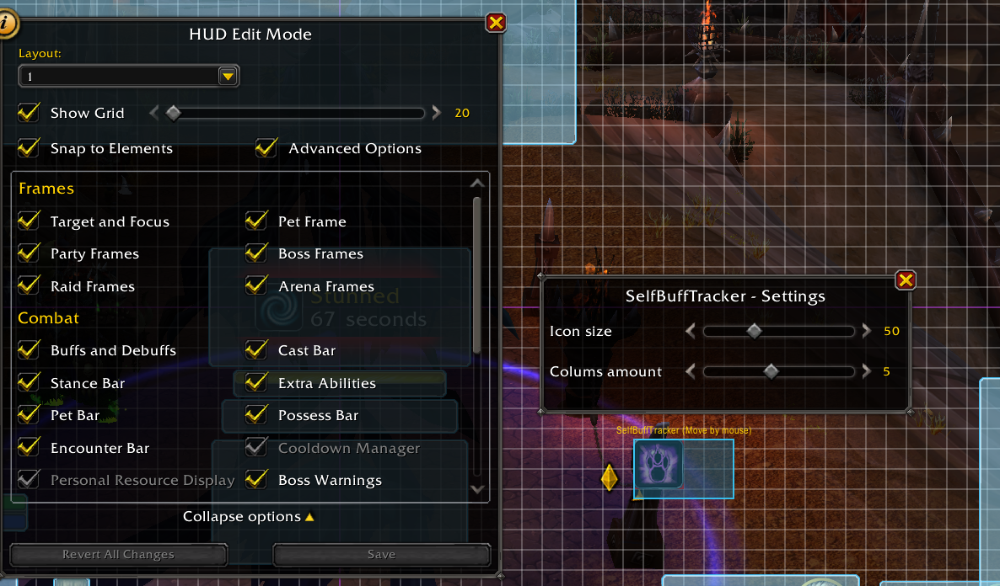

# SelfBuffTracker

**SelfBuffTracker** is a lightweight, customizable World of Warcraft addon that
tracks missing self-buffs, food buffs, flasks, and phials. It displays missing
effects as clickable icons and can play reminders before and during combat.

## Requirements

- World of Warcraft
- [Uwowea UI](../UI) installed and enabled as `Uwowea_UI`

## Features

- **Buff tracking:** Track any number of buffs or spells by spell name, spell
  link, or from the settings picker.
- **Flask and phial tracking:** Optionally track flasks and phials separately.
- **Clickable missing-buff icons:** Missing buffs appear as icons; click an
  icon to cast the associated spell when possible.
- **Configurable layout:** Change icon size, spacing, row and column count,
  screen position, and lock state.
- **Audio reminders:** Toggle alerts, choose a built-in or bundled sound, set
  a custom sound file ID, and configure the reminder interval.
- **Settings UI:** Configure the addon through the native WoW Settings panel.
- **Localization:** Select the game locale automatically or choose a supported
  language in settings.
- **Character profiles:** Settings and tracked effects are stored per
  character; settings can be copied from another character of the same class.
- **Spellbook and chat links:** Shift-click a spell link into the chat command
  line to add or remove it quickly.

## Getting started

1. Open **Settings** from the game menu.
2. Select **SelfBuffTracker - Settings**, or run `/sbt options`.
3. Add buffs in the tracked-buffs section. Enable flask tracking and configure
   tracked flasks in the tracked-flasks section when needed.
4. Unlock the display to position it, then lock it again.

The addon displays only effects that are currently missing. Configure audio
alerts and their reminder interval in the Settings panel.

## Bundled sounds

Addon authors can bundle a supported audio file and expose it as a sound preset:

1. Place the audio file in the addon's directory, for example `Sounds/alert.ogg`.
2. Add an entry to the `custom` list in `Sounds.lua`:

   ```lua
   { key = "my_alert", label = "My Alert", file = "Interface\\AddOns\\Uwowea_buff_tracker\\Sounds\\alert.ogg" },
   ```

The preset will appear under **Custom sounds** in the sound settings and can also be selected with `/sbt warning my_alert`.

## Screenshots

<p align="center">
  
  
  <br>
  
  
  <br>
  
  
  <br>
  
</p>

## Chat commands

Use `/sbt` or `/buff` in chat to configure the addon:

| Command | Description |
| --- | --- |
| `/sbt add [spell link or name]` | Adds a buff to track. |
| `/sbt remove [spell link or name]` | Removes a tracked buff. |
| `/sbt list` | Lists tracked buffs in the chat frame. |
| `/sbt sound` | Toggles audio alerts. |
| `/sbt size [number]` | Sets the icon size. Valid values are 2 through 300. |
| `/sbt cols [number]` | Sets the number of icon columns. |
| `/sbt warning list` | Lists available alert-sound presets. |
| `/sbt warning [preset]` | Selects an alert-sound preset. |
| `/sbt warning [sound file ID]` | Plays and uses a custom sound file ID. |
| `/sbt options` | Opens the Settings panel. |
| `/sbt config` | Alias for `/sbt options`. |

Run `/sbt` or `/buff` without a supported subcommand to print command help.

## Installation

### CurseForge

[SelfBuffTracker on CurseForge](https://www.curseforge.com/wow/addons/uwowea-selfbuftracker)

### Manual installation

1. Download the releases for SelfBuffTracker and its `Uwowea_UI` dependency.
2. Extract both folders into your WoW `Interface/AddOns` directory.
3. Ensure the folders are named `Uwowea_buff_tracker` and `Uwowea_UI`.
4. Enable **Uwowea Library: Buff tracker** and **Uwowea Library: UI** in the
   AddOns list, then reload the game UI with `/reload`.
